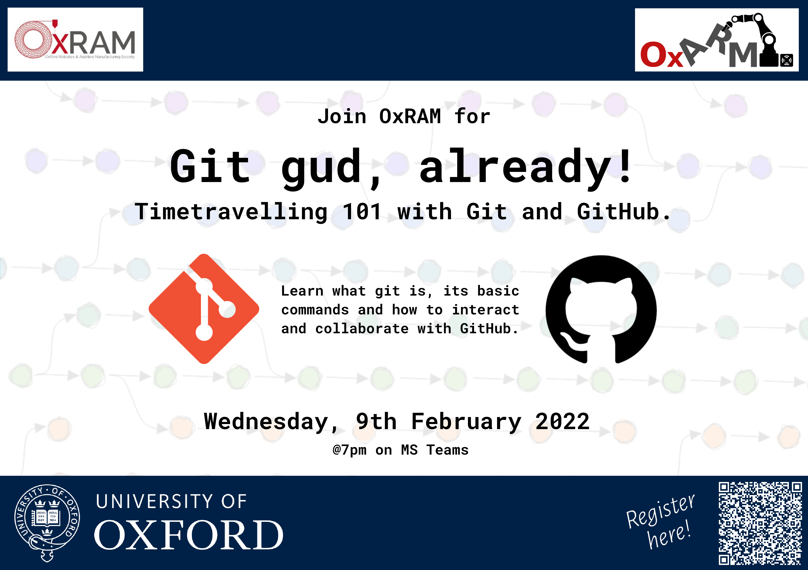

A very gentle introduction to [git](https://git-scm.com/) and [GitHub](https://github.com/) for the society, first presented on 09/02/2022.
You can download the full presentation [here](https://github.com/OxRAMSociety/gitgud/raw/main/presentation/presentation.html).

## License

Unless otherwise stated, the content of this repository is licensed under [Creative Commons Attribution Share-Alike 4.0 International License](http://creativecommons.org/licenses/by-sa/4.0/) 

The presentation is built with [reveal.js](https://revealjs.com/), which is distributed under [MIT license](presentation/reveal.js/LICENSE).

Some pictures used in the presentation are part of a [collection of illustrations](https://www.peppercarrot.com/en/files/framasoft.html) by [David Revoy](https://www.davidrevoy.com/) licensed under [Creative Commons Attribution 4.0 International License](http://creativecommons.org/licenses/by/4.0/) 
